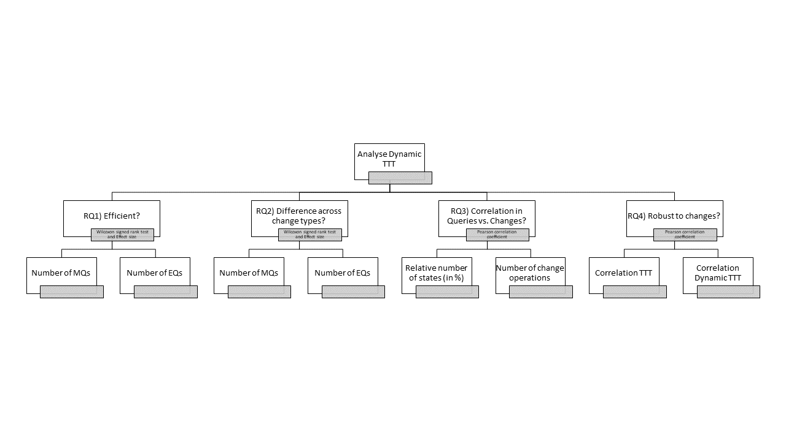

This is an [R Markdown](http://rmarkdown.rstudio.com) Notebook to analyze the adaptive learning algorithm: *Dynamic TTT*.
This notebook is organized in 4 steps, one for gathering the data required for each research question (RQ):

1. Load the log files.
2. Compare the overall efficiency of Dynamic TTT vs. traditional TTT.
3. Evaluate the efficiency of each learning methods per type of change.
4. Calculate the correlation between number of MQs and EQs per amount of changes.



```{r, message=FALSE}
options(digits=2)

# In the step 1, we load the log files with the number of queries posed by each 
# algorithm, types of changes deployed to simulate finite state machine (FSM) 
# evolution, and characteristics of each FSM model.


source('./utils.R')
rm(list.of.packages,new.packages)

# load the csv files
dirs <- list.dirs(path="../results/dfa/data/WP/", recursive=FALSE)

ldf <- list() # creates a list
count <- 1
for (i in dirs) {
  change_method <- strsplit(i,"//")[[1]][2]
  files <- list.files(path=i, pattern="*.csv", full.names=TRUE, recursive=FALSE)
  # print(files)
  
  for (file in files) {
    f_csv = read.csv(file, header=TRUE)
    f_control <- f_csv[f_csv$algorithm=='dfa/TTT',2:8]
    f_treatmt <- f_csv[!f_csv$algorithm=='dfa/TTT',c(2,5:8)]
    f_merged <- merge(f_control,f_treatmt, by=1, 
                      suffixes = c('_ttt', '_dyn'), 
                      all=TRUE)
    tot_na <- max(sapply(f_merged, function(x) sum(is.na(x))))
    if(tot_na>0){
      warning("WARNING: ", tot_na, " entries dropped from file '", file, "'\n")
    }
    f_merged <- drop_na(f_merged)
    f_merged$change <- change_method
    ldf[[count]] <- f_merged
    count<- count+1
  }
}
rm(f_csv,count,file,i,change_method,dirs,files)
rm(f_control,f_treatmt,f_merged, tot_na)
ldf <- do.call(rbind, ldf)
ldf$distance <- ldf$distance_dyn
ldf <- subset(ldf,select=-c(distance_dyn,distance_ttt))
ldf <- ldf[,c(1:3,10,11,4:9)]

```

```{r}

# In the step 2, we analyze the overall efficiency of the Dynamic TTT method 
# compared against the traditional TTT method in terms of numbers 
# of MQs and EQs posed by the algorithms.

step1_df <- data.frame(matrix(ncol = 7, nrow = 0))
colnames(step1_df) <- c("eq_type","comparison","pval","efsize_meth","efsize_name","efsize_magn","efsize_esti")

for (q_type in c("eq_count","mq_count")) {

  control<-ldf[, paste(q_type,"_ttt",sep = "")]
  treatmt<-ldf[, paste(q_type,"_dyn",sep = "")]
  
  # calculate the wilcox test 
  suppressWarnings(wilc<-wilcox.test(control, treatmt, paired = TRUE))
  
  ## compute effect sizes
  name_control<-"TTT"
  name_treatmt<-"dTTT"
  d <- (c(control, treatmt))
  f <- c(rep(c(name_control),each=length(control)) , rep(c(name_treatmt),each=length(treatmt)))
  
  # efsize <- cliff.delta(d,f)
  # efsize <- cohen.d(d,f)
  efsize <- VD.A(d,f)
  
  step1_df <- rbind(step1_df,
    data.frame(
      eq_type     = q_type,
      comparison  = paste(name_control,"_vs_",name_treatmt,sep=""),
      pval        = wilc$p.value,
      efsize_meth = efsize$method,
      efsize_name = efsize$name,
      efsize_magn = efsize$magnitude,
      efsize_esti = efsize$estimate
    )
  )
  
  rm(d, f)
  rm(efsize,wilc)
  rm(control, treatmt)
  rm(name_control, name_treatmt)
}
rm(q_type)

print(step1_df)

```

```{r}

# In the step 3, we evaluate the efficiency of 
# the learning methods per change type.

step2_df <- data.frame(matrix(ncol = 8, nrow = 0))
colnames(step2_df) <- c("eq_type","change_type","comparison","pval","efsize_meth","efsize_name","efsize_magn","efsize_esti")


for (q_type in c("eq_count","mq_count")) {
  for (ch_type in unique(ldf$change)) {
    sdf <- ldf[ldf$change == ch_type,]
    
    control<-sdf[, paste(q_type,"_ttt",sep = "")]
    treatmt<-sdf[, paste(q_type,"_dyn",sep = "")]
    
    # calculate the wilcox test 
    suppressWarnings(wilc<-wilcox.test(control, treatmt, paired = TRUE))
    
    
    ## compute effect sizes
    name_control<-"TTT"
    name_treatmt<-"dTTT"
    d <- (c(control, treatmt))
    f <- c(rep(c(name_control),each=length(control)) , rep(c(name_treatmt),each=length(treatmt)))
    
    # efsize <- cliff.delta(d,f)
    # efsize <- cohen.d(d,f)
    efsize <- VD.A(d,f)
    
    
    step2_df <- rbind(step2_df,
      data.frame(
        eq_type     = q_type,
        change_type     = ch_type,
        comparison  = paste(name_control,"_vs_",name_treatmt,sep=""),
        pval        = wilc$p.value,
        efsize_meth = efsize$method,
        efsize_name = efsize$name,
        efsize_magn = efsize$magnitude,
        efsize_esti = efsize$estimate
      )
    )
    
    rm(d, f)
    rm(efsize,wilc)
    rm(sdf,control, treatmt)
    rm(name_control, name_treatmt)
  }
}
rm(q_type,ch_type)
print(step2_df)

```

```{r}

# In this step 4, we calculate the correlation between number of queries 
# (i.e., MQ and EQ)  vs. amount of changes. 
# As unit of change, we consider:
# 
# - the number of states of the SUT
# - the absolute number of change operations

dict_label <- c()
dict_label[["eq_count"]] <- "Number of Equivalence Queries"
dict_label[["mq_count"]] <- "Number of Membership Queries"
dict_label[["ttt"]] <- "TTT"
dict_label[["dyn"]] <- "Dynamic TTT"
dict_label[["num_states"]] <- "Number of states"
dict_label[["distance"]]   <- "Amount of change operations"

# for (ch_type in unique(ldf$change)) 
{
  for (delta_type in c("num_states", "distance")) {
    for (q_type in c("eq_count","mq_count")) {
      for (lrn_method in c("ttt", "dyn")) {
        # for (corr_method in c("pearson", "kendall", "spearman")) {
        for (corr_method in c("pearson")) {
          # sdf <- ldf[ldf$change == ch_type,]
          sdf <- ldf
          a_plot <-ggpubr::ggscatter(sdf,
            x = paste(q_type,"_",lrn_method,sep = ""),
            y = delta_type,
            xlab = dict_label[q_type],
            ylab = dict_label[delta_type],
            title = paste("Method:",dict_label[lrn_method]),
            add = "reg.line",
            cor.method = corr_method,
            conf.int = TRUE, # Add confidence interval
            cor.coef = TRUE # Add correlation coefficient. see ?stat_cor
            )+theme(
              plot.title = element_text(hjust = 0.5),
            #   axis.text.x  = element_text(angle = 00, hjust=0.5, vjust=0.5),
            #   axis.text.y  = element_text(angle = 00, hjust=0.5, vjust=0.5),
            #   axis.title.x = element_text(angle = 00, hjust=0.5, vjust=0.5),
            #   axis.title.y = element_text(angle = 90, hjust=0.5, vjust=0.5)
          )
          print(a_plot)
          # filename <- paste(ch_type,q_type,lrn_method,delta_type,corr_method,"plot.png",sep = "_")
          # ggsave(filename, width = 6, height = 3.5, dpi=320)
          rm(a_plot,sdf)
        }
      }
    }
  }
}

```